[中文](README.md) | [English](README.en.md)

# LibraryDesk library circulation system · Java 21 / Spring Boot / Vue 3

**ZhiHua Technology (Shanghai Rujing Zhihua Information Technology Co., Ltd.)** · [Official website](https://www.zhuatech.cn/)

LibraryDesk serves small libraries, community reading rooms, workplace collections and independent school libraries. It manages titles, individual copies, patrons, loans, renewals and title-level holds. Staff use copy barcodes for check-out, normal/damaged returns and loss closure. Signed-in patrons search their library, place holds, view their own records and renew eligible loans.

**Public source learning edition / non-commercial source edition.** Publicly available source does not grant free commercial use. Personal learning and exchange only; commercial use requires written authorization from Shanghai Rujing Zhihua Information Technology Co., Ltd. See [LICENSE](LICENSE). Contact ZhiHua for licensing, deployment, customization and integration.

## Intended use and implemented features

| Role | Implemented abilities |
| --- | --- |
| Librarian | Categories and ISBN validation, copy barcodes/shelves, title archiving, damaged/withdrawn copies, borrower cards, barcode lookup, check-out/check-in, renewal and hold processing |
| Patron | Authenticated own-library catalog, own loans, holds and queue position, pickup deadline, cancellation and eligible renewal |
| Administrator | Accounts, password reset, enable/disable, permissions, data scope, library timezone, category dictionary, menus and five circulation parameters |
| Viewer | Library catalog and circulation reports; no circulation or editing |

MySQL persists data. The server validates CSRF, permissions, library scope, own-record scope, versions and state. Disabling an account/library or resetting a password revokes old sessions; the final full administrator is protected. Unused records can be deleted; records with circulation history must be archived, withdrawn or disabled.

Chinese/English interfaces, search, pagination, state filters, loan CSV, circulation events and audit trails are implemented. Barcode input supports keyboard-style scanners; Enter only looks up the copy and the transaction needs confirmation. Physical scanner hardware has not been validated.

## Circulation rules

- Defaults: 14 loan days, 5 open loans, 2 renewals, 3 active holds and a 48-hour pickup window. Administrators can change them. Existing loans retain period/renewal-limit snapshots; ready holds retain their deadlines.
- Each title has separate copies with globally unique barcodes. ISBN is not a copy barcode. ISBN may be empty; supplied ISBN-10/13 must pass checksum and own-library uniqueness checks.
- Check-out requires an available copy or one held for that patron, the same library, eligible privileges and a valid loan limit. Normal returns release copies; damaged/lost copies are not allocated.
- Title-level holds use creation time and ID order. Currently overdue patrons are skipped but stay waiting. Disabled accounts/privileges cause cancellation. Successful circulation actions and normal returns/cancellations process the affected queue.
- An expired pickup deadline cannot authorize pickup under that hold. Expiry cleanup and available-copy allocation happen during successful circulation operations or the librarian’s **Process queue** action. **No background scheduler or automated notifications** are implemented; staff should process queues routinely.
- The due date remains valid through that library’s local day. Overdue loans block new check-outs, holds and renewals. Another patron’s active hold also blocks renewal. Renewal adds the original loan period to the original due date.
- No fines, payments or deposits. Loss closure records the business result only.

## Actual running screens

Screenshots show real TEST acceptance data in this application, not real customers or customer cases. A fresh installation has no seeded titles or test accounts.

### Sign-in

Private account sign-in; no shared demo credentials.

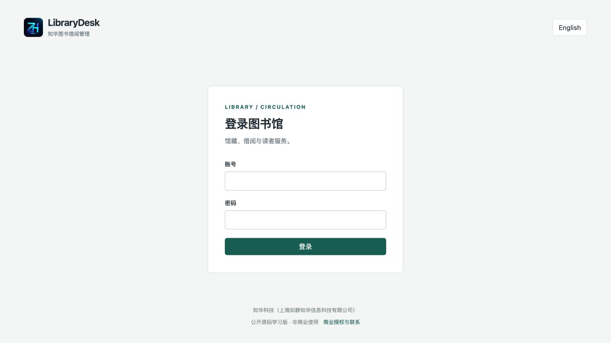

### Catalog

Search titles, categories and available-copy counts.

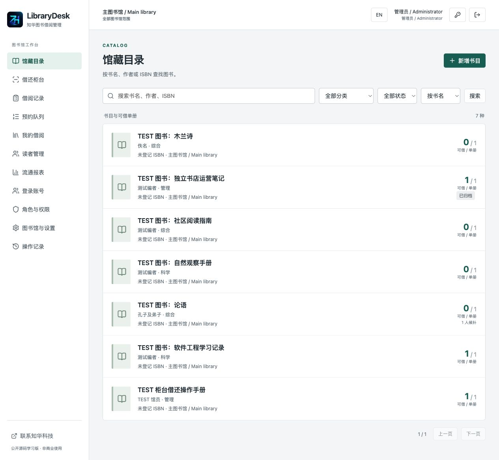

### Title and copies

Copy barcodes, shelf locations, state and real circulation events.

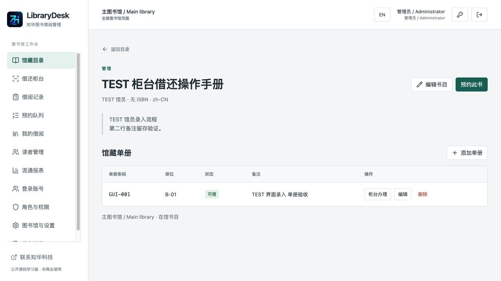

### Circulation desk

Look up a barcode, verify the patron and confirm check-out/check-in.

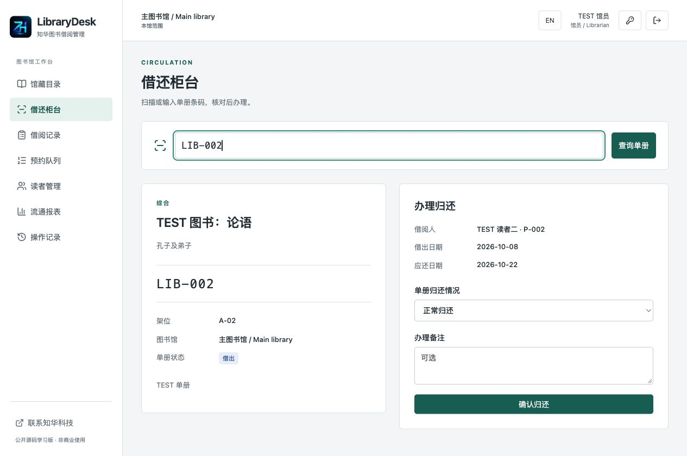

### Patrons

Link accounts to borrower cards and borrowing privileges.

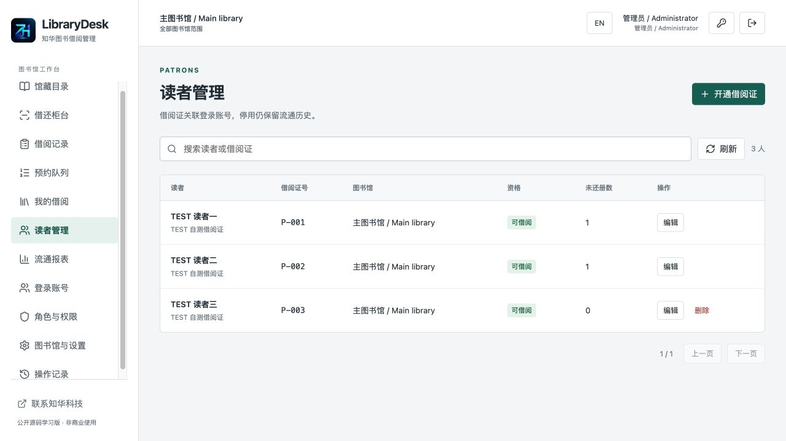

### Patron portal

Own holds, pickup deadline, queue position and cancellation.

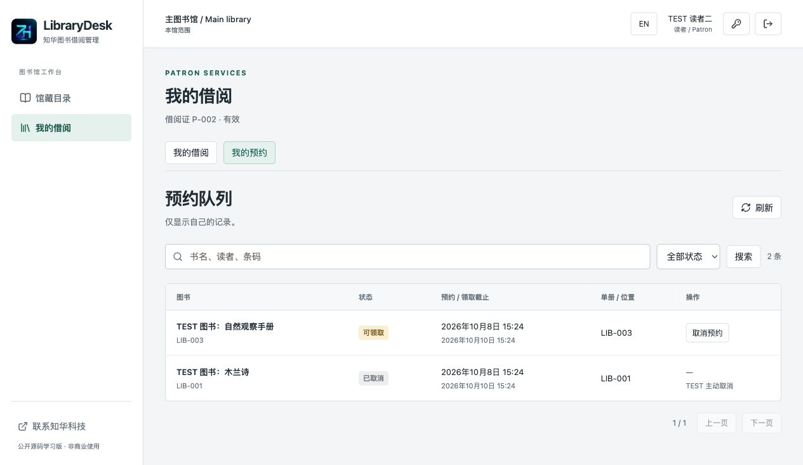

### Loans

Real loan/due dates, renewal counts and state.

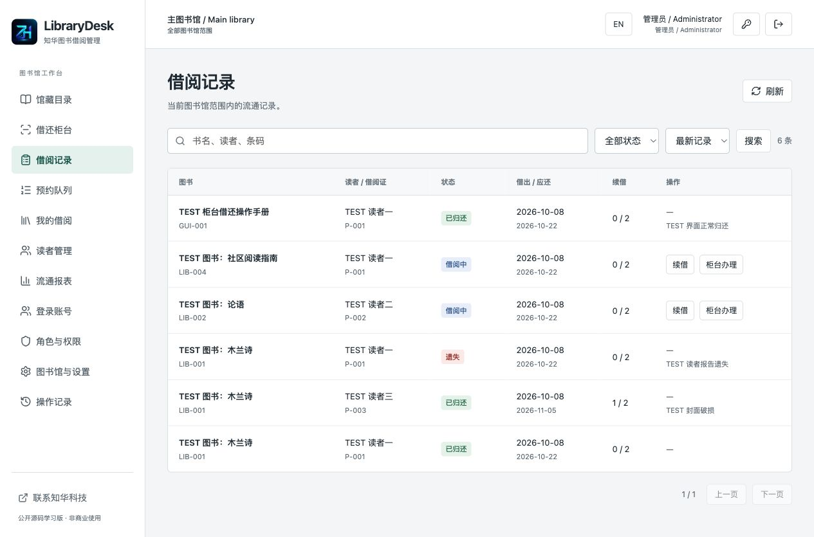

### Holds

Title-level queue allocates returned copies by eligibility and order.

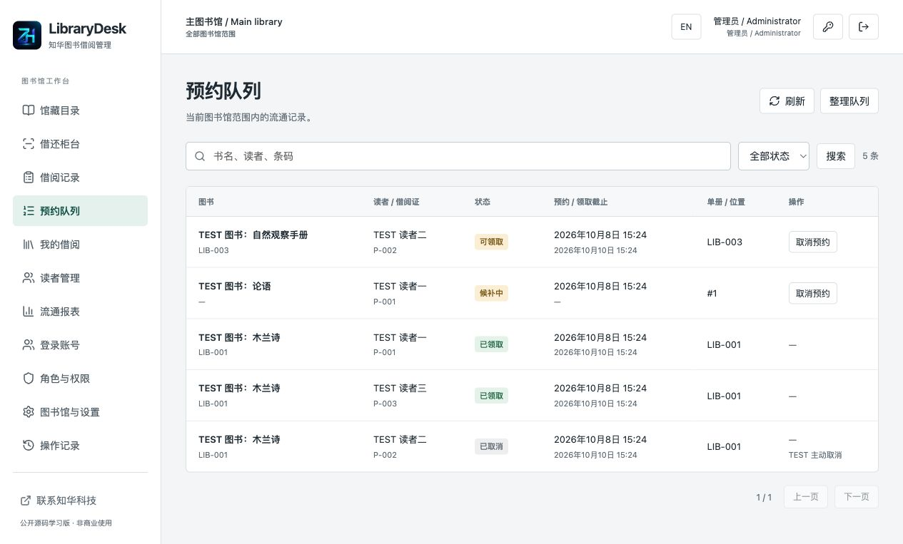

### Accounts

Administrators manage accounts, roles and libraries.

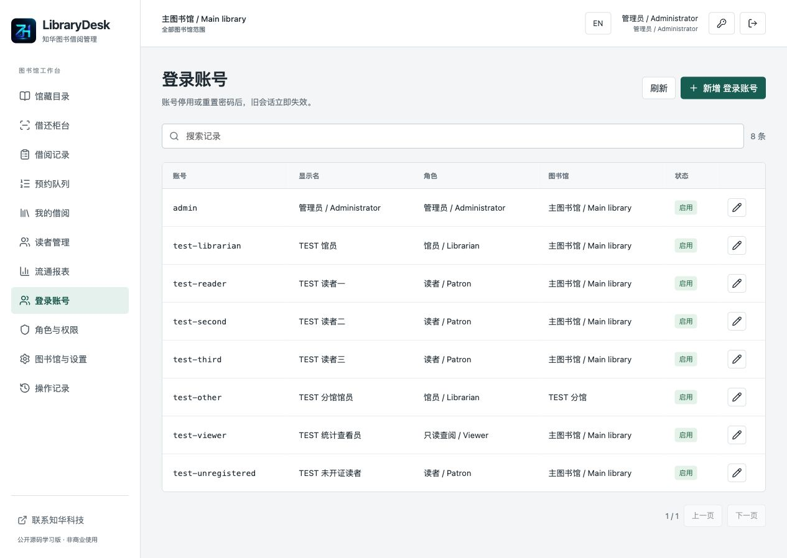

### Roles and permissions

Permissions and all-library, own-library or own-circulation scope.

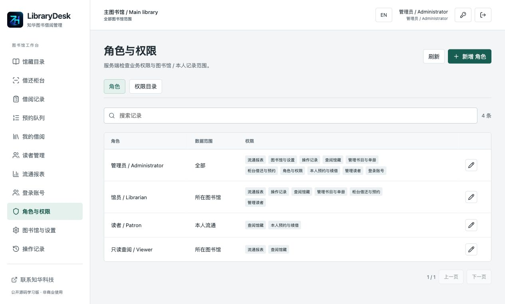

### Libraries and policies

Timezones, categories, loan periods, renewals and pickup window.

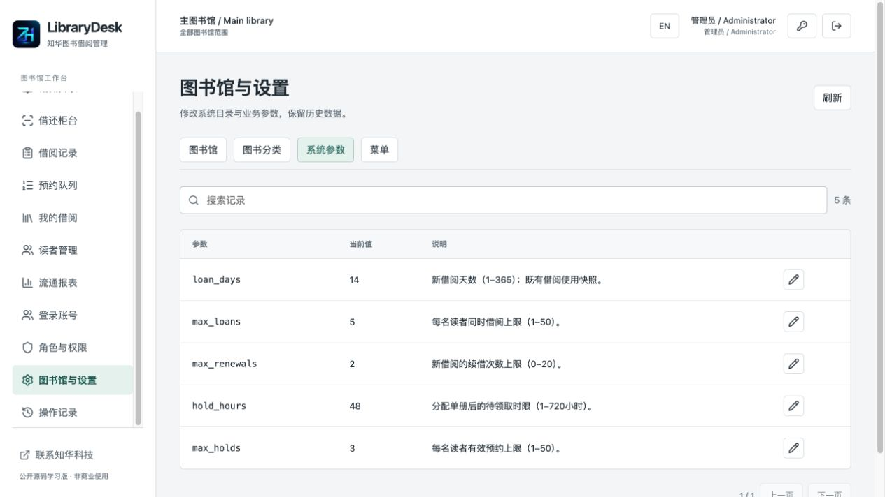

### Reports

Availability, circulation, holds, overdue metrics and loan CSV.

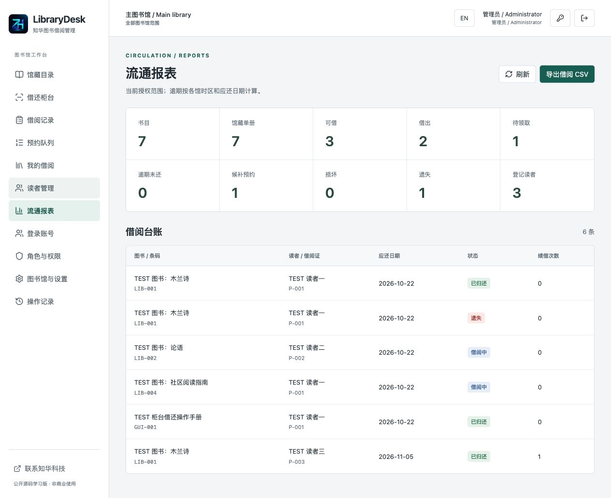

### Audit trail

View actual audit events within scope.

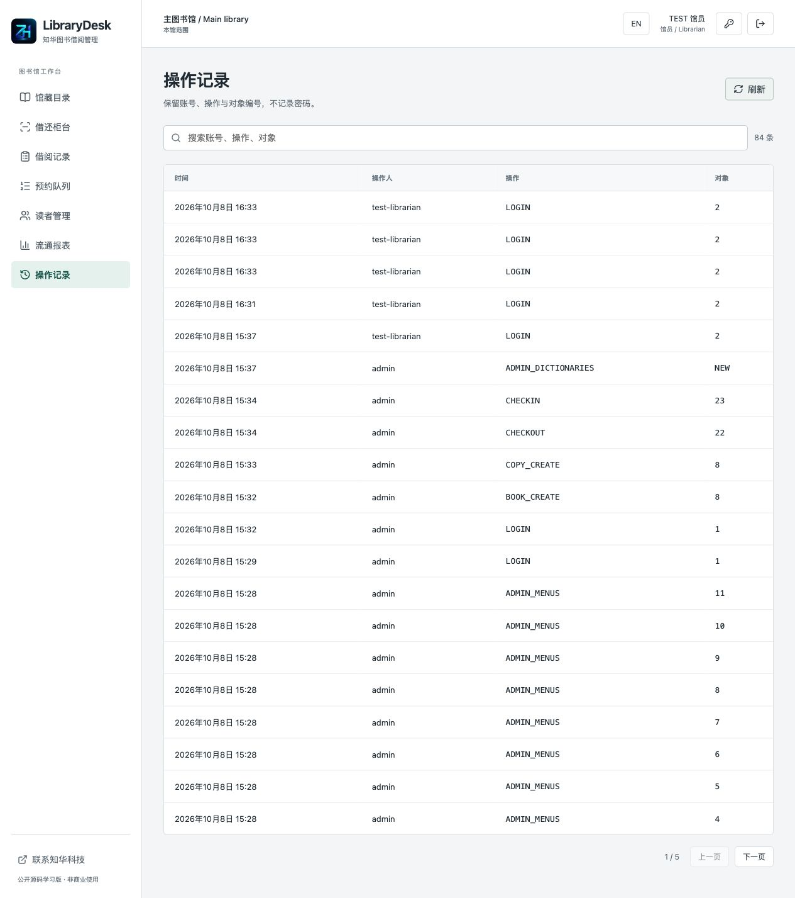

### Mobile patron view

Responsive catalog; wide tables scroll within their container.

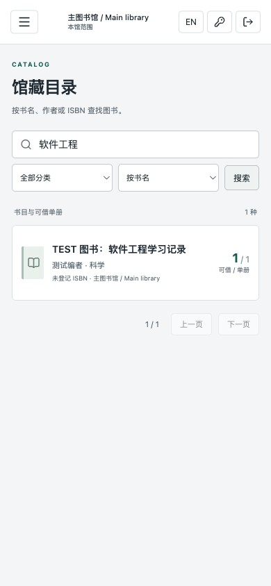

### English interface

Switch interface language without rewriting business data.

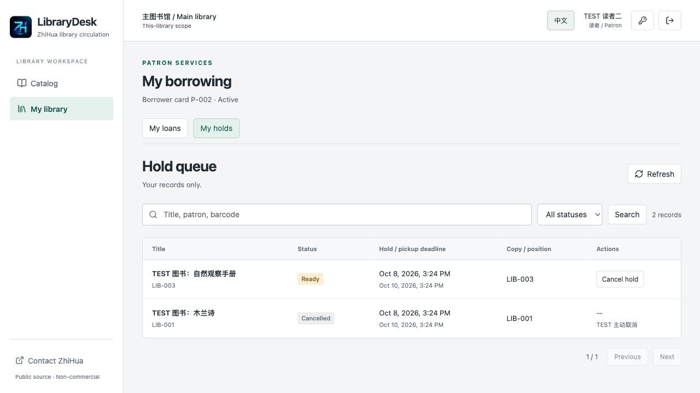

## Architecture and directories

Java 21, Spring Boot 4.0.7, Spring Security, JPA/Hibernate and Flyway; Vue 3.5.43, Vite 8.1.5 and Lucide; MySQL 8.4, Nginx and Docker Compose. The browser uses same-origin Nginx `/api/`; the backend persists data in MySQL. Health, sign-in and CSRF bootstrap allow anonymous access; catalog and other business endpoints require login. BCrypt, HttpOnly/SameSite sessions, CSRF and server-side scope are enforced independently. This is a single application instance; a database lock serializes writes to protect circulation states.

```text
backend/src/main/java/cn/zhuatech/librarydesk/  # identity, catalog, circulation
backend/src/main/resources/db/migration/     # versioned schema
backend/src/test/java/                       # HTTP + boundary tests
frontend/src/                               # Vue librarian/patron UI
frontend/public/brand/                      # logo and original contact assets
docs/screenshots/                           # actual running pages
scripts/                                   # QA, release check, backup/restore
compose.yaml                               # MySQL + backend + Nginx
.env.example                               # configuration names, no secrets
```

## Requirements and startup

Docker Engine / Docker Desktop and Compose V2; image builds need access to official Maven/npm/Docker registries. At least 4 GB available development memory is recommended. Source development requires JDK 21, Maven 3.9+, Node.js 24.19.0+, npm and Python 3.10+. Compose supplies MySQL; no host database installation is required.

```sh
python3 scripts/init-env.py
docker compose -p librarydesk config --quiet
docker compose -p librarydesk up -d --build --wait --wait-timeout 240
```

Open [http://127.0.0.1:8127/](http://127.0.0.1:8127/) and [health](http://127.0.0.1:8127/actuator/health). Initial username: `admin`; read `ADMIN_PASSWORD` from your private local `.env`. The initializer generates random credentials and refuses to overwrite `.env`; never upload it. Change your own password after first sign-in as needed. Changing environment values does not reset an existing database administrator.

## Database initialization and configuration

`V1__identity.sql` creates identity, roles, permissions, libraries, menus, dictionary, parameters and audit tables. `V2__circulation.sql` creates titles, copies, patrons, loans, holds and circulation events. Flyway applies versioned migrations automatically; Hibernate validates rather than overwrites the schema. There are 15 application tables plus Flyway history. An empty database initializes one administrator, one main library, four roles, ten permissions, eleven menus, four categories and five parameters, with no sample business data.

See [.env.example](.env.example). Compose stores MySQL data in a named volume. Preserve migration checksums; back up before upgrades and add versioned migrations rather than editing applied scripts.

| Variable | Default / purpose |
| --- | --- |
| MYSQL_ROOT_PASSWORD | Required, unique private database root password |
| DATABASE_PASSWORD | Required, unique application database password |
| ADMIN_USERNAME | `admin`; first empty database only |
| ADMIN_PASSWORD | Required; 12–72 bytes, uppercase/lowercase/digit; first empty database only |
| WEB_PORT | `8127` |
| BIND_ADDRESS | `127.0.0.1` |
| COOKIE_SECURE | `false` for localhost HTTP; `true` behind HTTPS |
| DATABASE_URL / DATABASE_USER | Optional external MySQL; bundled default user `librarydesk` |

External MySQL should use a dedicated least-privilege account, `sslMode=VERIFY_IDENTITY` and a trusted CA. Current backup/restore scripts support only the bundled Compose database. Initialization needs the required migration DDL permissions. Never commit actual credentials, customer data or backups.

## First workflow and deployment

1. Administrators maintain categories, library timezone and policies, then create librarians and borrowing accounts.
2. Librarians register cards for patron accounts, add titles and actual copy barcodes/shelf locations.
3. At the desk, look up the copy barcode, select the patron and confirm check-out. For returns, look up the barcode, verify the patron, select normal/damaged/lost condition and confirm.
4. Patrons sign in to search, hold, view own records or renew. Librarians process queues; pickup is checked out against the reserved copy.

See [deployment and backup](docs/DEPLOYMENT.md), [user guide](docs/USER_GUIDE.md) and [API/scope reference](docs/API.md). Internet deployment requires an HTTPS reverse proxy, `COOKIE_SECURE=true`, restricted network exposure, domain, backups and monitoring. This repository is validated with local Compose; public domain deployment and production capacity testing are not completed.

## Tests and acceptance

```sh
mvn -B -f backend/pom.xml spotless:check test package
cd frontend
npm ci --no-audit --no-fund
npm run format:check
npm run lint
npm test
npm run build
cd ..
python3 scripts/release-check.py
git diff --check
```

The backend includes 37 real MockMvc/JPA/Flyway integration tests and 15 boundary tests. The frontend has eleven request/error/form-isolation tests. Integration tests use isolated H2 MySQL mode; full deployment acceptance uses a fresh MySQL 8.4 volume. Backend Docker packaging runs tests without skipping them.

Run the following only against a disposable empty localhost instance. It creates TEST accounts and records and stops if the catalog is not empty. Credentials and evidence stay in ignored private `output/`.

```sh
python3 -m venv .venv
.venv/bin/pip install -r scripts/requirements-quality.txt
.venv/bin/black --check scripts
.venv/bin/python scripts/quality.py --base http://127.0.0.1:8127
.venv/bin/python scripts/verify-persistence.py --base http://127.0.0.1:8127
```

The flow covers roles/scopes, patron privacy, duplicate barcodes, hold reservation/order, cancellation promotion, damage/loss, blocked renewals, concurrent check-out, archiving, CSV and history protection. Controlled-clock integration tests cover overdue and exact deadline boundaries. Persistence is checked after restart. Backup pauses writes in the named backend; restore accepts only a fresh isolated project and refuses existing resources.

```sh
.venv/bin/python scripts/backup.py --project librarydesk --output private-backups/librarydesk.zip
# Create .env.restore privately with a different WEB_PORT, e.g. 28127.
.venv/bin/python scripts/restore.py private-backups/librarydesk.zip --project librarydesk-restore --env-file .env.restore
.venv/bin/python scripts/verify-persistence.py --base http://127.0.0.1:28127
```

## Known limits and third-party requirements

- Learning edition for small-library validation. Queries are bounded at 10,000 rows per entity; some reports/admin lists are computed in memory. No large-library capacity or high-concurrency load tests, and no production-readiness guarantee.
- No anonymous public catalog, inter-library transfers, bulk import, MARC/Z39.50, online ISBN metadata, e-books, RFID, self-service checkout machine or camera scanning integration.
- No scheduled expiry cleanup, email/SMS/WeChat notifications, SSO, fines, payments, deposits, holiday calendar or automatic printing.
- Original loan periods and events persist. Displayed title/patron names use current directories rather than complete historical name/title snapshots. Timestamp display uses browser timezone; due-day decisions use library timezone.
- Basic circulation requires no paid third-party service. Email/RFID integrations are not implemented; a commercial license does not make future capabilities complete. Third-party dependencies keep their own copyrights; see [third-party notices](docs/THIRD_PARTY.md).

## License and contact

Personal learning, research and non-commercial exchange only. Commercial use requires written authorization from Shanghai Rujing Zhihua Information Technology Co., Ltd. This is not an OSI open-source license or an MIT/Apache free-commercial license. [LICENSE](LICENSE) governs the source.

**ZhiHua Technology (Shanghai Rujing Zhihua Information Technology Co., Ltd.)** · [https://www.zhuatech.cn/](https://www.zhuatech.cn/)

For commercial licensing, customization, deployment and system integration:

- Email: [han@zhuatech.cn](mailto:han@zhuatech.cn)
- Email: [jack@zhuatech.cn](mailto:jack@zhuatech.cn)
- WhatsApp: [+86 17521234993](https://wa.me/8617521234993)
